# Docker Swarm Experiments

I've created this project while I've been playing around with docker swarm in order to understand its key concepts. 

It depends on:

* [VirtualBox](https://www.virtualbox.org/)
* [docker-machine](https://github.com/docker/machine)
  
**Caution:** *docker-machine* is actually outdated and not supported anymore.
It makes sense to move to [vagrant](https://www.vagrantup.com/) in the future.

All test setups were executed on Ubuntu 20.04 but should also work on newer Ubuntu or Debian distros.

Table of Contents
=================
<!--ts-->
- [Docker Swarm Experiments](#docker-swarm-experiments)
- [Table of Contents](#table-of-contents)
- [Setup a swarm cluster](#setup-a-swarm-cluster)
  - [Using bash helper functions (IMPORTANT)](#using-bash-helper-functions-important)
  - [Setup a custom cluster](#setup-a-custom-cluster)
  - [Setup Portainer](#setup-portainer)
- [Test Scenarios](#test-scenarios)
  - [Multiple services](#multiple-services)
    - [Rescale service instances](#rescale-service-instances)
    - [Trace the data flow](#trace-the-data-flow)
  - [Simulate Pseudo-PODs and sidecars](#simulate-pseudo-pods-and-sidecars)
    - [Trace the data flow](#trace-the-data-flow-1)
  - [Simulate PODs and sidecars](#simulate-pods-and-sidecars)
    - [Trace the data flow](#trace-the-data-flow-2)
  - [Multiple services registered at Consul](#multiple-services-registered-at-consul)
    - [Install Consul](#install-consul)

<!-- Created by https://github.com/ekalinin/github-markdown-toc -->
<!-- Added by: dnp, at: Di 21. Mär 03:27:02 CET 2023 -->

<!--te-->

Setup a swarm cluster
=====================

We want to setup a swarm cluster consisting of 3 VMs. 
Therefore we need:

* Virtual Box
* docker-machine
* a Docker Swarm cluster

These can be installed, as follows:

```
basics/00_virtualbox/setup.sh
basics/10_docker-machine/setup.sh
basics/20_swarm-cluster/setup.sh
```

Calling `docker-machine ls` shows you 3 nodes prefixed by `test-`:

```
NAME          ACTIVE   DRIVER       STATE     URL                         SWARM   DOCKER      ERRORS
test-node-1   -        virtualbox   Running   tcp://192.168.57.162:2376           v19.03.12   
test-node-2   -        virtualbox   Running   tcp://192.168.57.163:2376           v19.03.12   
test-node-3   -        virtualbox   Running   tcp://192.168.57.164:2376           v19.03.12   
```

Actually our cluster looks like:
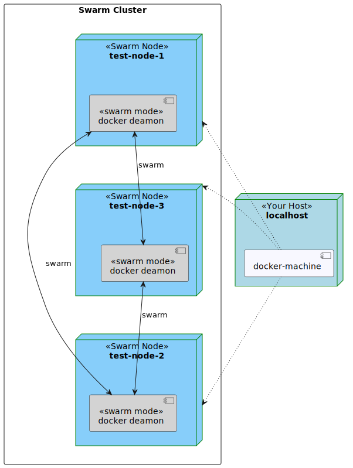

## Using bash helper functions (IMPORTANT)

For sake of convenience you may also use some helper functions and bash completion.
Just execute:

```
source common/lib/private/helpers.sh
stacks_manage setup basics
```

To see what helper functions are available use `pnhelp`.

**In all following steps we will assume that you've sourced the helper functions.**

## Setup a custom cluster

In case you want to setup a custom number of nodes and change the prefix, do as follows:

```
source common/helpers.sh
swarm set size 5
swarm set prefix custom-prefix
swarm stacks setup basics/20_swarm-cluster
```

Listing the machines shows you 5 additional machines prefixed by `custom-prefix`:

```
NAME                   ACTIVE   DRIVER       STATE     URL                         SWARM   DOCKER      ERRORS
custom-prefix-node-1   -        virtualbox   Running   tcp://192.168.57.165:2376           v19.03.12   
custom-prefix-node-2   -        virtualbox   Running   tcp://192.168.57.166:2376           v19.03.12   
custom-prefix-node-3   -        virtualbox   Running   tcp://192.168.57.167:2376           v19.03.12   
custom-prefix-node-4   -        virtualbox   Running   tcp://192.168.57.168:2376           v19.03.12   
custom-prefix-node-5   -        virtualbox   Running   tcp://192.168.57.169:2376           v19.03.12   
test-node-1            -        virtualbox   Running   tcp://192.168.57.162:2376           v19.03.12   
test-node-2            -        virtualbox   Running   tcp://192.168.57.163:2376           v19.03.12   
test-node-3            -        virtualbox   Running   tcp://192.168.57.164:2376           v19.03.12   
```

The custom cluster looks like:
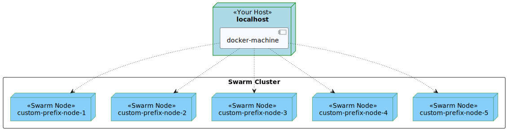


## Setup Portainer

Portainer can be helpful in order to check out what's happening in the Swarm cluster.
Portainer itself is published as part of the swarm.
It is installed as follows:
```
swarm stacks setup portainer
```

The previous command prints the URL where you can access the Portainer UI.
This can be accessed after some seconds:

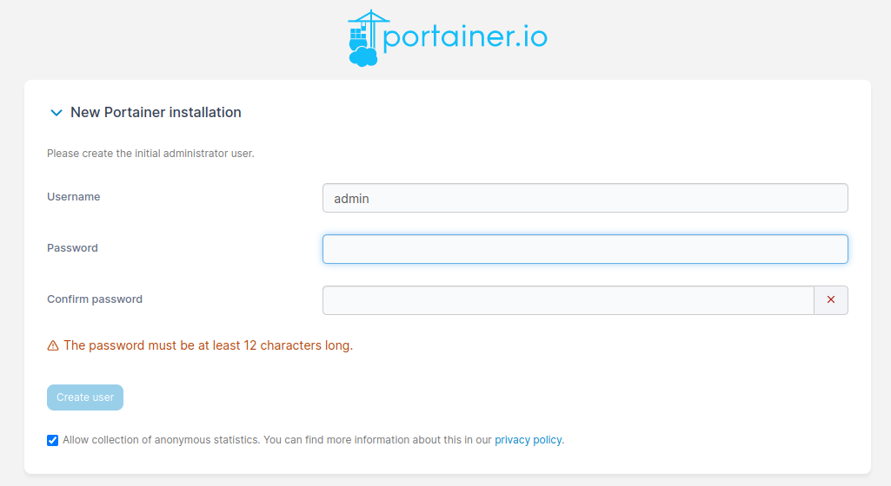

Just be a bit patient.
Set an admin password and continue.

The deployment looks as follows:
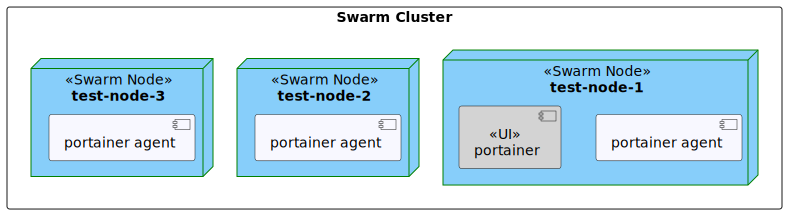

Within Portainer's cluster visualizer you can also see how the containers where deployed:

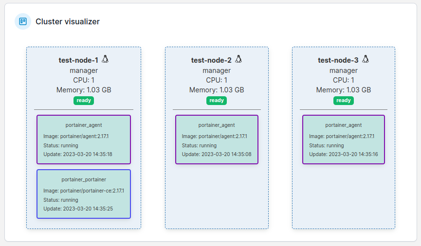


Test Scenarios
==============

## Multiple services

In a very simple scenario we want to deploy a chain or pipeline of replicated services.
The main goal is to see how the swarm's service discovery works.

We have five services building a pipeline, that starts and ends on your machine:

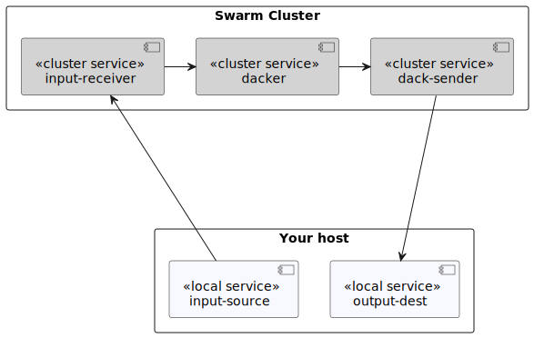

Deploy this setup, via:

```
stacks_manage setup setups/wsevent/svc-simple
```

The previous command tells you how to start the destintation service which consumes the output stream of `dack-sender`:

```
docker-machine use --unset && \
docker run --rm -it --network host thednp/wsevent \
    -consume $(docker-machine ip test-node-1):10080/dackservice-events \
    --no-produce \
    | sed -re 's|.*\(true\) ||'
```

The output looks like

```
...
8c3dfc84906f<- 8b75518a673b<- 14a8abe87696<- b562c52bb8ec<- 42671: :80: bpqzKFNfLu
8c3dfc84906f<- 8b75518a673b<- 14a8abe87696<- b562c52bb8ec<- 42672: :80: ssWApNLTTD
8c3dfc84906f<- 8b75518a673b<- 14a8abe87696<- b562c52bb8ec<- 42673: :80: OivrpbKoaV
8c3dfc84906f<- 8b75518a673b<- 14a8abe87696<- b562c52bb8ec<- 42674: :80: xtxWXKXVZD
8c3dfc84906f<- 8b75518a673b<- 14a8abe87696<- b562c52bb8ec<- 42675: :80: tJPGQZjTbP
...
```

Every service instance within the pipeline adds its "hostname" where only the input source creates payload in form of a random string.
This means that we can interpret the output as follows:

```
8c3dfc84906f<- 8b75518a673b<- 14a8abe87696<- b562c52bb8ec<- 42675:   :80: tJPGQZjTbP
^^^^^^^^^^^^   ^^^^^^^^^^^^   ^^^^^^^^^^^^   ^^^^^^^^^^^^   ^^^^^    ^^^  ^^^^^^^^^^
dack-sender    dacker         input-         input-source   counter  addr random
                              receiver                      messages      string
```

As all services are using an internal network called `dack-net` we also deploy a kind of a debug container (also in `dack-net`) allowing us to connect to the output of `input-receiver` and `dacker`.
Those wouldn't be accessible otherwise from outside the cluster.
The full deployment might look as follows:

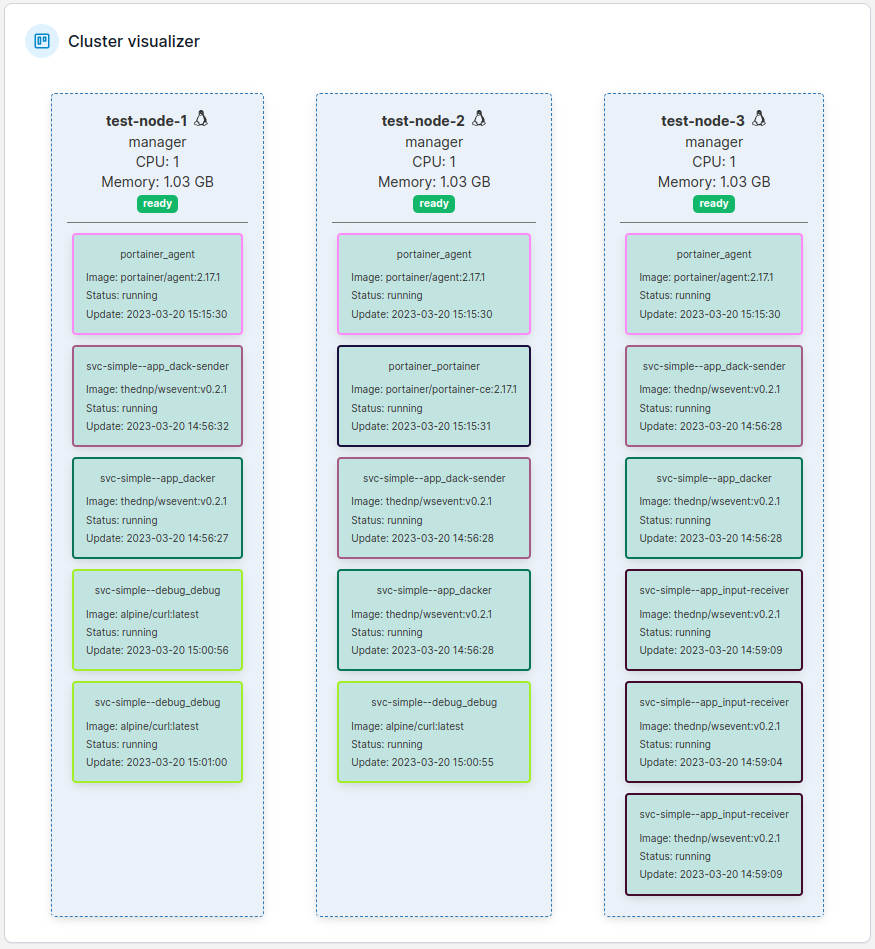

As you can see the tasks (containers) weren't scheduled as you might assume.
Multiple tasks of the same type (here: `input-receiver`) were placed on the same node.
This isn't optimal from a HA perspective but actually it is a coincidence which might differ from your execution.

In the section [Multiple services registered at Consul](#multiple-services-registered-at-consul) we will figure out how we can modify the scheduling strategy.
For now we can ignore it.

### Rescale service instances

In our example all 3 instances of `input-receiver` were scheduled on one node.
Let us reschedule the service instances of `input-receiver` by first scaling them down to 0:

```
docker-machine use test-node-1 && \
docker service ls \
    --filter name=svc-simple--app_input-receiver \
    --format '{{.ID}}' \
  | foreach docker service scale {}=0
```

and then scaling them up to 3 again:

```
docker-machine use test-node-1 && \
docker service ls \
    --filter name=svc-simple--app_input-receiver \
    --format '{{.ID}}' \
  | foreach docker service scale {}=3
```

After that the cluster visualizer shows us that all instances of `input-receiver` are now spreaded over all cluster nodes:

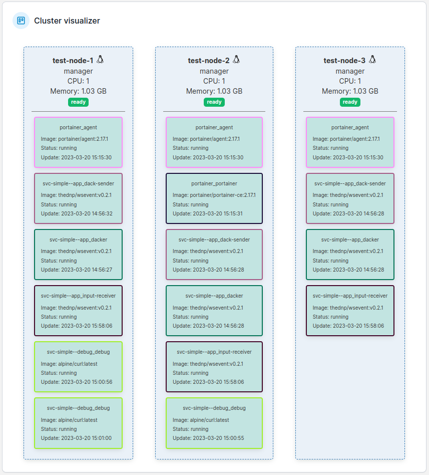

### Trace the data flow

Repeat the following step multiple times and see how the data flowed through all service instances:

```
docker-machine use --unset && \
docker run --rm -it --network host thednp/wsevent \
    -consume $(docker-machine ip test-node-1):10080/dackservice-events \
    --no-produce \
    | sed -re 's|.*\(true\) ||'
```

In my setup the following happened:

```
...
a51fd4eb9246<- 504c516431f9<- df0b4575953b<- 0142dcf720c0<- 4649: :80: EXGSwCZsIh
^^             ^^             ^^
dack-sender-1  dacker-1       input-receiver-1
...
...
8ecdd015aa0e<- 504c516431f9<- df0b4575953b<- 0142dcf720c0<- 4784: :80: cuoMZSVnZC
^^             ^^             ^^
dack-sender-2  dacker-1       input-receiver-1
...
...
885b6cbee2e6<- de563de3b7d0<- f9a28bfa1690<- 0142dcf720c0<- 4825: :80: hzMfDRBPur
^^             ^^             ^^
dack-sender-3  dacker-2       input-receiver-2
...
```

Again it is a coincidence which path the data took depending on which service was first available to its consumers. 


## Simulate Pseudo-PODs and sidecars

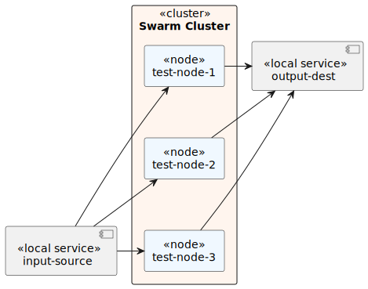

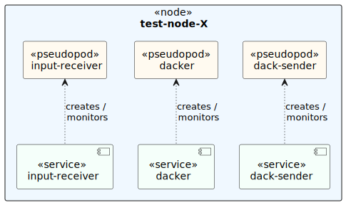

### Trace the data flow

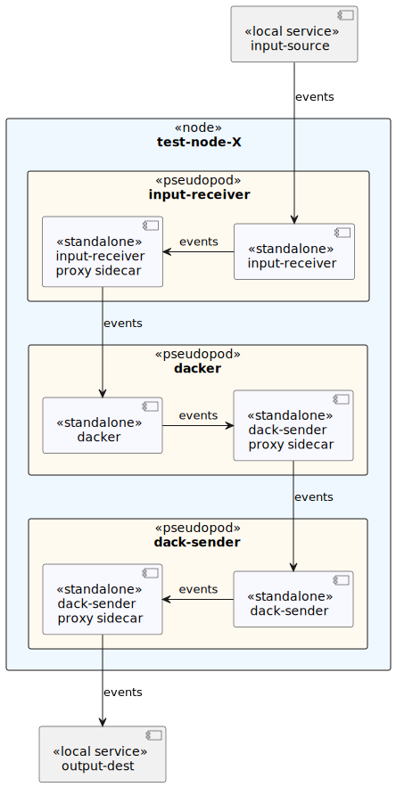

## Simulate PODs and sidecars

### Trace the data flow

Dump all paths taken:

```
swarm hosts  \
 | foreach docker-machine ssh {} -- \
    docker ps \
     \| grep -v proxy \
     \| grep svc.*app_ \
     \| sed -re '"s/^(.)/{}\\t\\1/"' \
      | awk '{print "echo -n "$1":; docker-machine ssh "$1" -- docker logs --tail 1 "$2}' \
      | xargs -i bash -c '{}' 2>&1 \
      | sed -re 's|^(test-node-.):.*true\) |\1 |' \
            -e  's|[0-9]+: :.*||' \
      | perl -ne '/^(?:.*?<-\s){3}\n$/ && print' \
      | sort -u
```

Dump all services involved:

```
swarm hosts   \
 | foreach docker-machine ssh {} -- \
    docker ps \
     \| grep proxy \
     \| sed -re '"s/^(.)/{}\\t\\1/"' \
      | awk '{print $1" "$2}'
```

## Multiple services registered at Consul

I've attempted to test how docker swarm and consul can play together.
It is based on different blogs or web sources:

* https://itnext.io/enable-services-auto-discovery-in-docker-swarm-in-15-minutes-ae30f3877dc8
* https://www.virtualbox.org/wiki/Linux_Downloads

### Install Consul

This section performs all steps described in this blog post:

* https://itnext.io/enable-services-auto-discovery-in-docker-swarm-in-15-minutes-ae30f3877dc8

Do as follows:
```
consul/setup.sh
```

The previous command prints the URL where you can access the Consul UI.
